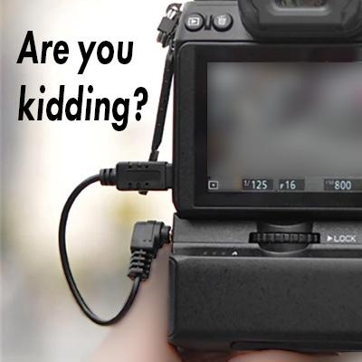
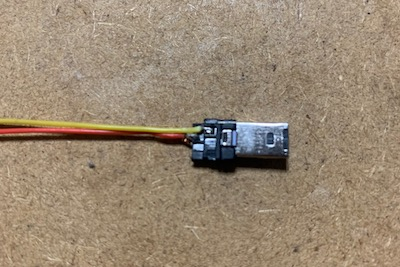
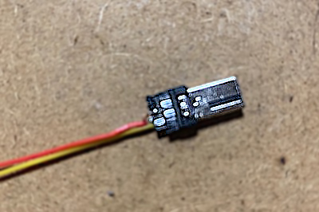

どなたかカメラ側のコネクタについて情報をお待ちではないでしょうか？ issue #1 をご覧下さい。  
Does anyone have information about camera side connector? Please see issue #1 .
# MB-N10-alter-cable
これは Aliexpress で売っている Nikon MB-N10互換品のケーブルを改造して  
より使いやすく(邪魔にならない)ケーブルを作るプロジェクトです。  
This project is making cable more comfortable(no hindrance) for alternative of  
Nikon MB-N10 that sold on Aliexpress.  
like this https://a.aliexpress.com/_mL9nkIQ  

## Prereqeties (Bill of materials)
* (as sacrifice) Remote cable sold as N3 in aliexpress.  
like as https://a.aliexpress.com/_mMu5x4e
* 2.5 phi stereo L angle phone jack.
* (about 8 phi)Heat shrink tube.
* UV resin.
* some soldering skill.
## Preparation
1. Cut phone jack from remote cable.  
1. Remove plastic cover from camera side connector.  
like as  
  
  
1. Connect wires to phone jack.  
1. (if needed) cover phone jack by UV resin for soldering.  
1. Cover heat shrink tube from camera side connector.  
1. Use heat to shrink, at this time be careful to shape the connector  
into an L angle shape.
## Connection diagram

## Finished products
  

